# Architecture Overview

**Document ID:** `LAWYERS-ARCH-001`
**Version:** `1.0`
**Date:** `2023-10-27`
**Status:** `Draft`
**Category:** `architecture`

## 1. Introduction

### 1.1. Purpose

This document provides a high-level overview of the system architecture for the "Lawyers" project website. It details the primary components, their interactions, and the data flows for key user journeys. The goal is to establish a shared understanding among the development team of how the frontend, backend, database, and third-party services will work together to meet the project's business objectives.

### 1.2. Project Goals

The website aims to achieve three primary goals:
1.  **Generate Qualified Leads:** Attract Non-Resident Indians (NRIs) seeking legal services in India.
2.  **Enable Direct Bookings:** Facilitate a seamless, timezone-aware process for scheduling and paying for initial consultations.
3.  **Build Credibility:** Serve as a professional online presence showcasing Kalanidhi Sanjeeva Kumar's 20 years of expertise and building trust with a global audience.

## 2. System Components

The system is designed using a decoupled architecture, with a modern frontend communicating with a backend API. This separation of concerns enhances scalability, maintainability, and developer experience.

*   **Frontend (Client-side):** A responsive web application built with **Next.js** and styled with **Tailwind CSS**. It is responsible for rendering the user interface, managing client-side state, and communicating with the backend API. It will be deployed to **Vercel's Edge Network** for global performance.

*   **Backend (Server-side):** A **Node.js API** built with the **Express** framework. It will run as serverless functions on **Vercel**. This API handles all business logic, data processing, and secure communication with the database and third-party services.

*   **Database:** A **PostgreSQL** database will serve as the primary data store. Data access is managed through the **Prisma ORM**, which provides type-safety and simplifies database queries. It will store user information, booking details, payment records, and content metadata.

*   **Third-Party Services:**
    *   **Google Calendar API:** For real-time availability checks and automated creation of consultation events in the advocate's calendar.
    *   **Payment Gateways (Razorpay & PayPal):** To process payments for consultations. Razorpay will be the primary gateway for its multi-currency support, with PayPal as a secondary option.
    *   **Email Service (Resend):** For transactional emails, such as booking confirmations and notifications. Resend is chosen for its modern API and seamless integration with Vercel.
    *   **Secure File Storage (Vercel Blob):** For securely storing client-submitted documents. Vercel Blob is chosen for its direct integration with the deployment platform, simplifying infrastructure management.

## 3. High-Level Architecture Diagram

The following diagram illustrates the flow of requests and data between the user, the core application components, and external services.

```mermaid
graph TD
    subgraph "User's Browser"
        User(👤 NRI Client)
    end

    subgraph "Vercel Platform"
        Frontend(🌐 Next.js Frontend)
        Backend(⚙️ Node.js/Express API <br> on Serverless Functions)
    end

    subgraph "Data & Storage"
        DB[(🐘 PostgreSQL DB <br> w/ Prisma)]
        BlobStore(📦 Vercel Blob <br> Secure Document Storage)
    end

    subgraph "Third-Party Services"
        GCalendar(📅 Google Calendar API)
        Payment(💳 Razorpay / PayPal API)
        EmailSvc(📧 Resend API)
    end

    User -- Interacts --> Frontend

    Frontend -- API Calls (HTTPS) --> Backend

    Backend -- Reads/Writes --> DB
    Backend -- Manages Files --> BlobStore
    Backend -- Checks Availability/Creates Events --> GCalendar
    Backend -- Processes Payments --> Payment
    Backend -- Sends Notifications --> EmailSvc

    style User fill:#F9F9F9,stroke:#1B4F72,stroke-width:2px
    style Frontend fill:#F9F9F9,stroke:#2980B9,stroke-width:2px
    style Backend fill:#F9F9F9,stroke:#2980B9,stroke-width:2px
    style DB fill:#F9F9F9,stroke:#F39C12,stroke-width:2px
    style BlobStore fill:#F9F9F9,stroke:#F39C12,stroke-width:2px
```

## 4. Core User Flows & Data Interaction

### 4.1. Consultation Booking and Payment Flow

This is the primary user journey, involving real-time data from multiple services.

1.  **View Availability:**
    *   The user navigates to the `/booking` page and selects their timezone.
    *   The **Next.js Frontend** sends an API request to the **Backend** (`/api/availability`).
    *   The **Backend** authenticates with the **Google Calendar API** using stored credentials (OAuth 2.0 tokens).
    *   The **Backend** fetches the advocate's free/busy schedule for the upcoming weeks.
    *   The **Backend** processes this data, applies business logic (e.g., consultation duration, buffer times), converts slots to the user's selected timezone, and returns a list of available slots to the **Frontend**.

2.  **Select Slot & Initiate Payment:**
    *   The user selects a time slot and fills out a brief intake form.
    *   The **Frontend** sends a request to the **Backend** to create a pending booking (`/api/bookings/initiate`).
    *   The **Backend** creates a payment order with **Razorpay** (or PayPal) for the specified consultation fee.
    *   The **Backend** saves a "pending" booking record in the **PostgreSQL Database** and returns the `order_id` from Razorpay to the **Frontend**.

3.  **Process Payment:**
    *   The **Frontend** uses the `order_id` to launch the Razorpay Checkout modal.
    *   The user completes the payment within the secure Razorpay interface.

4.  **Confirm Booking:**
    *   Razorpay sends a `payment.captured` webhook to a dedicated endpoint on our **Backend** (`/api/webhooks/razorpay`). This is the primary source of truth for payment success.
    *   Upon successful webhook validation, the **Backend** performs the following atomic operations:
        a.  Updates the booking status from "pending" to "confirmed" in the **PostgreSQL Database**.
        b.  Calls the **Google Calendar API** to create a new event in the advocate's calendar with the client's details and a link to the consultation (e.g., WhatsApp contact info).
        c.  Calls the **Resend API** to send a confirmation email to the client, including appointment details, next steps, and a unique, secure link for document submission.
    *   The **Frontend**, which has been polling or waiting for a callback, receives confirmation and displays a success message to the user.

### 4.2. Secure Document Submission Flow

This flow ensures client documents are handled securely and are associated with the correct booking.

1.  **Access Upload Page:**
    *   The client clicks the secure link from their confirmation email. The link contains a unique token associated with their booking.
    *   The **Frontend** renders a dedicated document upload page and validates the token with the **Backend**.

2.  **Request Upload URL:**
    *   When the user selects a file to upload, the **Frontend** requests a pre-signed upload URL from the **Backend** (`/api/uploads/generate-url`).
    *   The **Backend** verifies the user's token, generates a secure, time-limited pre-signed URL from **Vercel Blob**, and returns it to the frontend.

3.  **Upload File:**
    *   The **Frontend** uploads the file directly to **Vercel Blob** using the pre-signed URL. This offloads the bandwidth from our backend server.

4.  **Confirm Upload:**
    *   Upon successful upload, the **Backend** receives a confirmation (or the frontend sends a confirmation) and updates the booking record in the **PostgreSQL Database** with a reference to the stored file's path.

### 4.3. Content Management (Blog/Case Studies)

To maintain simplicity and leverage the Next.js framework, static and semi-static content will be managed directly within the codebase.

*   **Source:** Blog posts, case studies, and testimonials will be written as **MDX (`.mdx`) files**. This allows for rich text formatting with the ease of Markdown, while also enabling the use of React components directly within the content.
*   **Rendering:** Next.js's Static Site Generation (SSG) capabilities will be used to pre-render these pages at build time. `getStaticProps` and `getStaticPaths` will read from the file system to generate the HTML, ensuring maximum performance and SEO benefits.
*   **Management:** Content updates require a code commit and a new deployment, which is a suitable workflow given the expected frequency of updates.

## 5. Technology Stack Summary

| Component           | Technology / Service                                      | Rationale                                                                        |
| ------------------- | --------------------------------------------------------- | -------------------------------------------------------------------------------- |
| **Frontend**        | [Next.js](https://nextjs.org/) (React Framework)          | Industry-standard for performant React apps; provides SSG, SSR, and API routes. |
| **Styling**         | [Tailwind CSS](https://tailwindcss.com/)                  | A utility-first CSS framework for rapid, consistent, and responsive UI development.      |
| **Backend**         | [Node.js](https://nodejs.org/) with [Express](https://expressjs.com/) | A mature and widely-supported JavaScript runtime, ideal for building APIs.       |
| **Database ORM**    | [Prisma](https://www.prisma.io/)                          | Modern, type-safe ORM that simplifies database interactions and migrations.      |
| **Database**        | [PostgreSQL](https://www.postgresql.org/)                 | A robust, reliable, and feature-rich open-source relational database.          |
| **Deployment**      | [Vercel](https://vercel.com/)                             | All-in-one platform for frontend and serverless functions with zero-config CI/CD. |
| **Scheduling**      | [Google Calendar API](https://developers.google.com/calendar) | For real-time synchronization of the advocate's availability.                  |
| **Payments**        | [Razorpay](https://razorpay.com/), [PayPal](https://www.paypal.com/)             | Robust payment processing with excellent support for international currencies.    |
| **Email**           | [Resend](https://resend.com/)                             | A modern, developer-focused email API for reliable transactional emails.         |
| **File Storage**    | [Vercel Blob](https://vercel.com/storage/blob)            | Secure, easy-to-use file storage integrated directly into the Vercel ecosystem. |

## 6. Deployment and Infrastructure

The entire application will be hosted on **Vercel**, leveraging its integrated platform for a streamlined CI/CD pipeline.

*   **Repository:** The codebase will be hosted on a Git provider (e.g., GitHub).
*   **Continuous Deployment:** Every `git push` to the main branch will automatically trigger a new deployment on Vercel.
*   **Frontend Deployment:** The Next.js application will be deployed to Vercel's global Edge Network, caching static assets close to users worldwide for low latency.
*   **Backend Deployment:** The Node.js/Express API, located in the `/pages/api` directory of the Next.js project, will be automatically deployed as scalable, cost-effective Serverless Functions.
*   **Environment Variables:** All secrets, API keys, and database connection strings will be managed securely using Vercel's Environment Variables settings. They will not be stored in the codebase.

## 7. Security Considerations

Security is a primary concern, especially when handling client data and payments.

*   **Data in Transit:** All communication between the client, frontend, and backend will be encrypted using HTTPS/TLS, enforced by Vercel.
*   **Data at Rest:** Sensitive client documents stored in Vercel Blob are encrypted at rest. The PostgreSQL database should also be configured for encryption at rest.
*   **Authentication:** Backend API endpoints will be protected, and requests will be validated to ensure they originate from authenticated sources or valid user sessions.
*   **Secrets Management:** API keys and credentials for third-party services will be stored as environment variables and never exposed on the client-side.
*   **Payment Processing:** All payment processing is offloaded to PCI-compliant gateways (Razorpay/PayPal). No sensitive credit card information is ever handled by our servers.
*   **Input Validation:** All user input will be rigorously validated and sanitized on the backend to prevent common vulnerabilities like XSS and SQL injection. Prisma helps mitigate SQL injection by design.