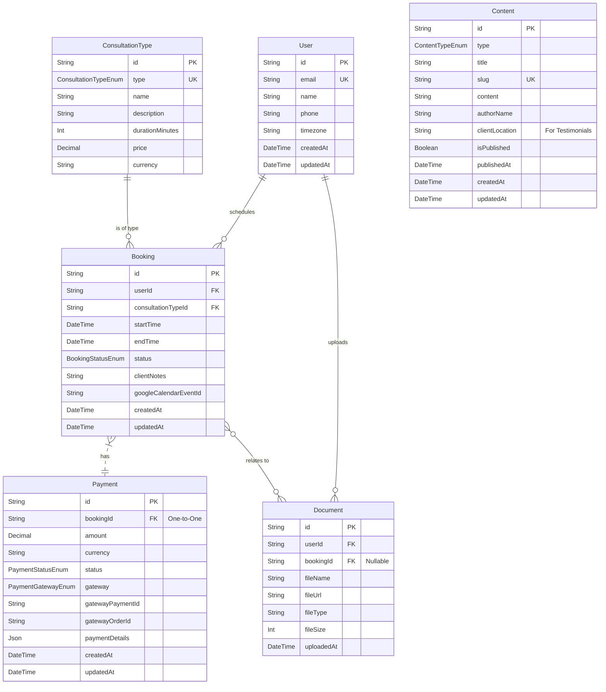

# Database ERD & Migrations

-   **Document Type**: Database ERD & Migrations
-   **Category**: backend
-   **Purpose**: This document specifies the complete database schema for the "lawyers" project. It defines the structure for storing user information, booking details, payment statuses, and content management entities. It is designed to be the single source of truth for the application's data layer, implemented using PostgreSQL and managed via the Prisma ORM.

---

## 1. Introduction

The database is the core of the application's backend, responsible for persisting all stateful information. This schema is designed to support the primary business goals: lead generation from NRIs, direct booking of paid consultations, and content management for building credibility.

We will use **PostgreSQL** for its robustness and rich feature set, and **Prisma** as the Object-Relational Mapper (ORM) to provide a type-safe and developer-friendly interface between the Node.js application and the database. This document details the entities, their attributes, and the relationships between them.

## 2. Entity-Relationship Diagram (ERD)

The following diagram illustrates the high-level relationships between the main entities in the database.



**Key Relationships:**

*   A `User` can have multiple `Bookings` and upload multiple `Documents`.
*   A `Booking` must belong to one `User` and be of one `ConsultationType`.
*   Each `Booking` has exactly one associated `Payment`.
*   A `Document` is uploaded by a `User` and may optionally be associated with a specific `Booking`.
*   The `Content` table is a polymorphic-like entity to store Blog Posts, Case Studies, and Testimonials, differentiated by a `type` enum.

## 3. Prisma Schema Definition

The following is the complete Prisma schema (`schema.prisma`) that defines all models, enums, and relations. This schema is used by Prisma to generate the database client and manage migrations.

```prisma
// This is your Prisma schema file,
// learn more about it in the docs: https://pris.ly/d/prisma-schema

generator client {
  provider = "prisma-client-js"
}

datasource db {
  provider = "postgresql"
  url      = env("DATABASE_URL")
}

// ----------------------------------------
// ENUMS
// ----------------------------------------

enum BookingStatus {
  PENDING    // Initial status when booking is created but not yet paid
  CONFIRMED  // Payment successful, booking is confirmed
  COMPLETED  // Consultation has occurred
  CANCELLED  // Booking was cancelled by user or admin
}

enum PaymentStatus {
  PENDING   // Payment initiated but not completed
  SUCCESS   // Payment successfully processed
  FAILED    // Payment failed
}

enum PaymentGateway {
  RAZORPAY
  PAYPAL
}

enum ConsultationCategory {
  AUDIO_CALL
  DOCUMENT_REVIEW
}

enum ContentType {
  BLOG_POST
  CASE_STUDY
  TESTIMONIAL
}

// ----------------------------------------
// MODELS
// ----------------------------------------

/// Represents a client, typically an NRI, who signs up to book a consultation.
model User {
  id        String    @id @default(cuid())
  email     String    @unique
  name      String?
  phone     String?   // To be used for WhatsApp communication
  timezone  String    // e.g., "America/New_York", crucial for scheduling
  createdAt DateTime  @default(now())
  updatedAt DateTime  @updatedAt

  bookings  Booking[]
  documents Document[]

  @@map("users")
}

/// Defines the types of consultations offered, e.g., 30-min call.
model ConsultationType {
  id              String               @id @default(cuid())
  type            ConsultationCategory @unique // Ensures only one entry per category
  name            String               // e.g., "30-Minute Audio Consultation"
  description     String
  durationMinutes Int                  // e.g., 30
  price           Decimal              // Price in a base currency (e.g., INR)
  currency        String               @default("INR")

  bookings Booking[]

  @@map("consultation_types")
}

/// Represents a scheduled appointment between a user and the advocate.
model Booking {
  id                 String         @id @default(cuid())
  startTime          DateTime       // The scheduled start time in UTC
  endTime            DateTime       // The scheduled end time in UTC
  status             BookingStatus  @default(PENDING)
  clientNotes        String?        // Brief details about the legal matter from the intake form
  googleCalendarEventId String?     // ID of the event in Google Calendar for sync
  createdAt          DateTime       @default(now())
  updatedAt          DateTime       @updatedAt

  user               User             @relation(fields: [userId], references: [id])
  userId             String
  consultationType   ConsultationType @relation(fields: [consultationTypeId], references: [id])
  consultationTypeId String

  payment            Payment?         // One-to-one relation with Payment
  documents          Document[]       // Documents associated with this booking

  @@map("bookings")
}

/// Stores details of a payment transaction for a booking.
model Payment {
  id               String         @id @default(cuid())
  amount           Decimal        // The amount paid
  currency         String         // The currency of the transaction (e.g., "USD", "INR")
  status           PaymentStatus  @default(PENDING)
  gateway          PaymentGateway // Razorpay or PayPal
  gatewayPaymentId String         // The transaction ID from the payment gateway
  gatewayOrderId   String?        // The order ID from the payment gateway (useful for Razorpay)
  paymentDetails   Json?          // Raw response from the gateway for auditing

  createdAt DateTime @default(now())
  updatedAt DateTime @updatedAt

  booking   Booking @relation(fields: [bookingId], references: [id])
  bookingId String  @unique // Enforces a one-to-one relationship

  @@map("payments")
}

/// Represents a document securely uploaded by a user.
model Document {
  id         String   @id @default(cuid())
  fileName   String   // Original name of the file
  fileUrl    String   // Secure, signed URL pointing to the file in cloud storage (e.g., S3)
  fileType   String   // MIME type, e.g., "application/pdf"
  fileSize   Int      // Size in bytes
  uploadedAt DateTime @default(now())

  user   User   @relation(fields: [userId], references: [id])
  userId String

  booking   Booking? @relation(fields: [bookingId], references: [id])
  bookingId String?  // A document can be optionally linked to a booking

  @@map("documents")
}

/// A generic model for storing content like blog posts, case studies, and testimonials.
model Content {
  id             String      @id @default(cuid())
  type           ContentType
  title          String
  slug           String      @unique // URL-friendly identifier
  content        String      // Can store Markdown or HTML
  authorName     String?     // For Blog Posts/Case Studies, e.g., "Kalanidhi Sanjeeva Kumar"
  clientLocation String?     // For Testimonials, e.g., "USA", "UK"
  isPublished    Boolean     @default(false)
  publishedAt    DateTime?

  createdAt DateTime @default(now())
  updatedAt DateTime @updatedAt

  @@map("content")
}
```

## 4. Database Migrations Strategy

Database migrations will be managed exclusively through **Prisma Migrate**. This ensures that schema changes are version-controlled, repeatable, and safe to apply across different environments (development, staging, production).

### Workflow

1.  **Modify the Schema**: Any changes to the database schema MUST be made by editing the `schema.prisma` file.
2.  **Generate Migration Files (Development)**: After modifying the schema, run the following command to generate a new SQL migration file and apply it to your local development database.
    ```bash
    npx prisma migrate dev --name <migration-name>
    ```
    -   `<migration-name>` should be a short, descriptive name for the change (e.g., `add_user_timezone`).
    -   This command creates a new directory in `prisma/migrations/` containing a `migration.sql` file.
3.  **Applying Migrations (Production)**: In a production environment (like on Vercel), migrations should be applied without prompting. This is typically done as part of the deployment build step.
    ```bash
    npx prisma migrate deploy
    ```
    -   This command applies all pending migrations without generating new ones or resetting the database.

### Important Rules

-   **NEVER** edit the generated `migration.sql` files manually. All changes must originate from `schema.prisma`.
-   **ALWAYS** commit the `prisma/migrations` directory to version control.
-   Ensure the `DATABASE_URL` environment variable is correctly configured in all environments.

## 5. Initial Data Seeding

To ensure the application has the necessary foundational data upon startup, we will use a Prisma seed script. This is particularly useful for populating the `ConsultationType` table.

The seed script will be located at `prisma/seed.ts`.

### Example Seed Script (`prisma/seed.ts`)

```typescript
import { PrismaClient, ConsultationCategory } from '@prisma/client';

const prisma = new PrismaClient();

async function main() {
  console.log('Start seeding...');

  // Seed Consultation Types
  await prisma.consultationType.upsert({
    where: { type: ConsultationCategory.AUDIO_CALL },
    update: {},
    create: {
      type: ConsultationCategory.AUDIO_CALL,
      name: '30-Minute NRI Audio Consultation',
      description: 'A 30-minute audio call via WhatsApp to discuss your legal matter. Ideal for initial case evaluation and guidance.',
      durationMinutes: 30,
      price: 5000, // Example price in INR
      currency: 'INR',
    },
  });

  await prisma.consultationType.upsert({
    where: { type: ConsultationCategory.DOCUMENT_REVIEW },
    update: {},
    create: {
      type: ConsultationCategory.DOCUMENT_REVIEW,
      name: 'Legal Document Review Service',
      description: 'A comprehensive review of your legal documents (up to 20 pages). You will receive a summary report with legal advice and next steps.',
      durationMinutes: 0, // Duration is not time-based for this service
      price: 10000, // Example price in INR
      currency: 'INR',
    },
  });

  console.log('Seeding finished.');
}

main()
  .catch((e) => {
    console.error(e);
    process.exit(1);
  })
  .finally(async () => {
    await prisma.$disconnect();
  });
```

### Running the Seed Script

The seed script is executed by adding it to the `package.json` and running it via the Prisma CLI.

**`package.json`:**

```json
{
  "prisma": {
    "seed": "ts-node prisma/seed.ts"
  }
}
```

**Execution Command:**

```bash
npx prisma db seed
```

This command should be run after the initial migration is applied to a new database environment.