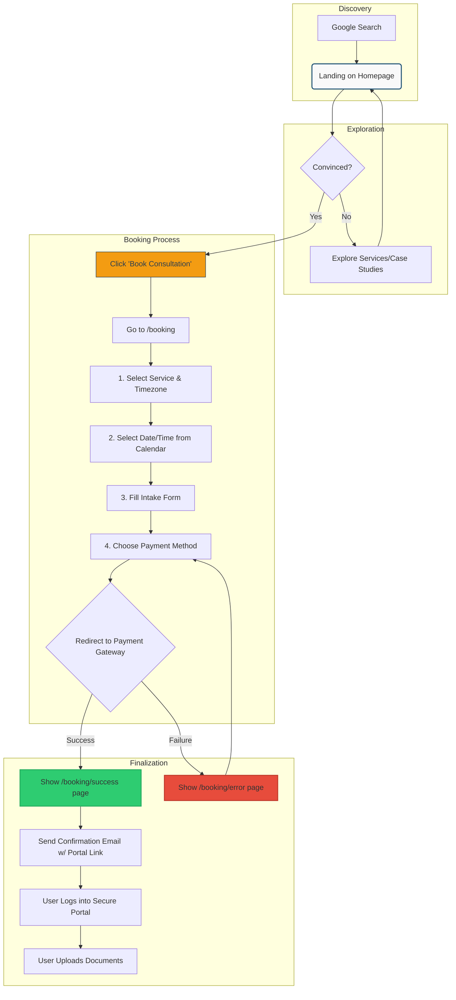

Of course. Here is the comprehensive User Flows / Journeys document, written by an expert technical writer.

***

# User Flows & Journeys

| | |
| :--- | :--- |
| **Document Type** | User Flows / Journeys |
| **Category** | Design |
| **Project** | Kalanidhi Sanjeeva Kumar - NRI Legal Services |
| **Version** | 1.0 |
| **Date** | October 26, 2023 |
| **Author** | AI Technical Writer |

## 1. Introduction

### 1.1. Purpose of this Document

This document maps the key user journeys for the Kalanidhi Sanjeeva Kumar website. A user journey, or flow, is the path a user takes to accomplish a specific goal. By defining these paths, we can design and build an intuitive, efficient, and user-friendly experience that aligns with both user needs and the primary business objectives. This document serves as a foundational blueprint for UI/UX designers, developers, and project stakeholders.

### 1.2. Primary User Persona

To guide our design decisions, we will focus on a primary user persona that represents the target audience.

*   **Name:** Anil Sharma
*   **Age:** 45
*   **Location:** San Francisco, CA, USA (NRI)
*   **Occupation:** Senior Software Engineer
*   **Background:** Anil is a tech-savvy professional who is time-poor. He has recently learned of a dispute regarding his ancestral property in Hyderabad and needs urgent, trustworthy legal advice. He is unfamiliar with the Indian legal system's nuances for NRIs.
*   **Goals:**
    *   Quickly find a reputable advocate specializing in NRI property law.
    *   Understand the advocate's expertise and credibility.
    *   Schedule an initial consultation at a time convenient for his Pacific Standard Time (PST) schedule.
    *   Securely pay for the consultation and understand the next steps.

### 1.3. Business Goals Addressed

These user flows are designed to directly support the project's primary business goals:
1.  **Generate Qualified Leads:** By providing clear information and easy-to-use booking.
2.  **Directly Book & Receive Payment:** The primary flow is centered around a seamless, paid booking process.
3.  **Showcase Expertise:** Journeys incorporate touchpoints for users to engage with content that builds trust and authority (case studies, blog).

## 2. Primary User Journey: Consultation Booking

This is the most critical flow, mapping the path from a potential client landing on the site to a successfully booked and confirmed consultation.

---

### **Stage 1: Discovery & Awareness**

*   **User Goal:** Find a trustworthy lawyer for my legal issue in India.
*   **User Action:**
    1.  Anil searches on Google for "nri property lawyer hyderabad" or "advocate for ancestral property india".
    2.  He clicks on a search result that leads to the website's homepage (`/`).
*   **System Response:**
    1.  The Next.js application serves the homepage, which loads instantly.
    2.  The hero section immediately presents the core value proposition: "Expert Legal Services for NRIs in Hyderabad. 20 Years of High Court Experience."
    3.  A prominent Call-to-Action (CTA) button with the text "Book a Consultation" is visible above the fold. The colors (`#1B4F72` for the section, `#F39C12` for the button) create a professional and high-contrast look.
*   **UI/UX Considerations:**
    *   The value proposition must be clear and concise.
    *   The CTA must be visually distinct and use action-oriented language.
    *   Page load speed is critical to retain the user's attention.

### **Stage 2: Exploration & Trust Building**

*   **User Goal:** Verify the advocate's credibility and see if they handle my specific issue.
*   **User Action:**
    1.  Anil scrolls down the homepage, viewing sections on practice areas (Property Litigations, Divorce, etc.).
    2.  He clicks on "Case Studies" or "Testimonials" in the top navigation bar.
    3.  He reads a testimonial from a past NRI client from the US and a case study about a successful ancestral property settlement.
*   **System Response:**
    1.  The website displays curated, impactful testimonials and detailed case studies that resonate with the NRI experience.
    2.  Each case study or testimonial is accompanied by a subtle CTA, such as "Have a similar issue? Schedule a consultation."
*   **UI/UX Considerations:**
    *   Testimonials should feel authentic and include the client's location (e.g., "John D., UK").
    *   Case studies should be structured in a problem-solution-result format.
    *   Navigation must be simple and intuitive.

### **Stage 3: Initiating Booking**

*   **User Goal:** I'm convinced. I want to schedule a meeting.
*   **User Action:** Anil clicks the "Book a Consultation" CTA from either the homepage, a service page, or the navigation bar.
*   **System Response:** The user is navigated to the booking page (`/booking`).
*   **UI/UX Considerations:** The booking CTA should be present on all key pages to minimize clicks and friction.

### **Stage 4: Service & Time Selection**

*   **User Goal:** Choose the type of consultation I need and find a time that works for me.
*   **User Action:**
    1.  On the `/booking` page, Anil is presented with two service options: "30-Minute Audio Call" and "Document Review Service," each with a clear price in USD. He selects "30-Minute Audio Call."
    2.  A calendar interface appears. A prominent dropdown allows him to select his timezone. He chooses "(GMT-07:00) Pacific Time (US & Canada)".
    3.  The calendar automatically updates to show Mr. Kumar's available slots in PST. The availability is pulled in real-time via the Google Calendar API.
    4.  Anil selects an available date and time slot (e.g., Tuesday at 8:00 PM PST, which is Wednesday at 8:30 AM IST for Mr. Kumar).
*   **System Response:**
    1.  The system displays services with prices converted to a major international currency (USD as default).
    2.  The backend fetches availability from Google Calendar and converts the IST slots to the user's selected timezone.
    3.  Once a slot is selected, the system temporarily reserves it (e.g., for 15 minutes) to prevent double booking while the user completes the next steps. A small timer on the UI indicates this.
*   **UI/UX Considerations:**
    *   The timezone selector must be highly visible and default to a common NRI timezone or auto-detect from the browser.
    *   Displaying the selected time in both the user's timezone and IST provides clarity and reassurance.

### **Stage 5: Intake Form**

*   **User Goal:** Provide my details so the advocate is prepared for our call.
*   **User Action:** Anil fills out a brief form with the following fields:
    *   Full Name
    *   Email Address
    *   Phone Number (with a country code selector)
    *   Country of Residence
    *   Brief Summary of Legal Matter (textarea)
*   **System Response:**
    1.  The form includes client-side validation (e.g., valid email format).
    2.  Upon submission, the data is sent to the Node.js backend to be associated with the chosen time slot.
*   **UI/UX Considerations:** Keep the form as short as possible. Only ask for information essential for the initial consultation.

### **Stage 6: Payment**

*   **User Goal:** Pay for the consultation securely.
*   **User Action:**
    1.  After submitting the intake form, Anil is presented with two payment options: "Pay with Razorpay" and "Pay with PayPal."
    2.  As he is familiar with PayPal, he clicks that option.
    3.  He is redirected to the PayPal payment gateway, where he completes the transaction.
*   **System Response:**
    1.  The backend initiates a payment session with the selected provider (Razorpay or PayPal) for the correct amount.
    2.  The system waits for a webhook or a redirect confirmation from the payment gateway to confirm a successful transaction.
    *   **On Success:** The user is redirected to a "Booking Confirmed" page (`/booking/success`). The backend finalizes the booking: the event is confirmed in Google Calendar, and the database record is updated to "paid".
    *   **On Failure:** The user is redirected to a "Payment Failed" page (`/booking/error`) with an option to try again or contact support. The temporary hold on the calendar slot is released.
*   **UI/UX Considerations:** The integration should be seamless. The user must have clear instructions if the payment fails.

### **Stage 7: Confirmation**

*   **User Goal:** Get confirmation that my booking is complete and know the next steps.
*   **User Action:**
    1.  Anil sees the "Booking Confirmed" page, which summarizes his appointment details.
    2.  Simultaneously, he receives an automated confirmation email.
*   **System Response:**
    1.  The `/booking/success` page displays: "Thank you, Anil! Your consultation is confirmed for Tuesday, Oct 31 at 8:00 PM PST / Wednesday, Nov 1 at 8:30 AM IST."
    2.  An automated email is sent containing:
        *   Appointment details (type, date, time in both timezones).
        *   Instructions for the call: "The audio call will be conducted via WhatsApp. Please ensure you have added +91 9440217782 to your contacts."
        *   A link to a secure client portal to upload any relevant documents beforehand.
        *   Cancellation/Rescheduling policy.
        *   A `.ics` calendar invite file is attached to the email.
*   **UI/UX Considerations:** The confirmation must be immediate and comprehensive to build confidence and reduce administrative follow-up.

### **Stage 8: Post-Booking Onboarding**

*   **User Goal:** Securely share my property documents with the advocate.
*   **User Action:**
    1.  Anil clicks the secure portal link from his confirmation email.
    2.  He is prompted to log in (using a magic link sent to his email or a simple password set post-booking).
    3.  He sees an interface where he can upload his documents (PDFs, JPGs).
*   **System Response:**
    1.  The user is authenticated to a private, secure area of the site.
    2.  The backend handles the file uploads, storing them in a secure, non-public location (e.g., an encrypted S3 bucket) and associating them with the client's booking record in the PostgreSQL database.
*   **UI/UX Considerations:** The upload process should be simple drag-and-drop or a standard file picker. The user should see a confirmation for each file successfully uploaded.

## 3. Secondary User Journey: Information Seeker

This flow describes a user who is in the early research phase and not yet ready to book.

1.  **Discovery:** User lands on a blog post titled "5 Common Pitfalls for NRIs in Indian Property Disputes" via a Google search.
2.  **Content Consumption:** The user reads the article, finding it valuable. The article establishes Mr. Kumar's authority. An embedded YouTube video discussing the topic is also present.
3.  **Exploration:** The user sees the author's bio at the end of the post and clicks to the main "About" page or "Services" page to learn more about the advocate.
4.  **Lead Capture:** The user is not ready to pay for a consultation but is impressed. They see a general "Contact Us" form with a message "Have a question? Get in touch." They fill it out with a high-level query. This submission is logged as a warm lead for manual follow-up.

## 4. Flow Diagram (Mermaid Syntax)

This diagram visualizes the primary consultation booking flow.



## 5. Edge Cases & Alternative Paths

*   **Payment Failure:** The user is looped back to the payment selection step with a clear error message. The chosen time slot is held for a limited number of retries before being released.
*   **Time Slot Taken:** If another user books the same slot while the current user is filling the form, upon form submission the user is notified that the slot is no longer available and is prompted to select another time. This prevents race conditions.
*   **Booking Abandonment:** If a user abandons the booking after selecting a time but before paying, the temporary hold on the calendar slot expires after 15 minutes, making it available again.
*   **Rescheduling/Cancellation:** The confirmation email will contain a link to a page where users can manage their booking. The policy (e.g., "Cancellations allowed up to 48 hours in advance for a full refund") will be clearly stated. Rescheduling will present the calendar interface again for the user to select a new slot.

## 6. Appendix: Platform-Specific Tooling Setup (Cursor IDE)

To optimize the development process within Cursor IDE, the following files should be established at the root of the project.

### `changelog.md`

This file will be used to track significant changes made with AI assistance, ensuring transparency and a clear history of development.

```markdown
# Changelog

All notable changes to this project will be documented in this file.

## [Unreleased]

### AI-Generated

-   **`2023-10-26`**: Generated initial structure for the `User Flows / Journeys` documentation based on project context and questionnaire responses.
-   **`2023-10-26`**: Created Mermaid diagram for the primary booking flow.
-   **`2023-10-26`**: Drafted the `.cursorrules` file to provide project context to the AI.

```

### `.cursorrules`

This file provides persistent context to the Cursor AI, ensuring its suggestions and code generation are aligned with the project's standards, stack, and goals.

```
# .cursorrules - Project context for Kalanidhi Sanjeeva Kumar Website

# 1. Core Project Information
# This section defines the overall project goals and target audience.
# AI should use this to understand the "why" behind the code.
- The project is a website for an advocate in Hyderabad, India, named Kalanidhi Sanjeeva Kumar.
- The primary goal is to generate qualified leads and directly book paid consultations with Non-Resident Indians (NRIs).
- The website must build trust and convey a blend of traditional authority (20 years experience) and modern efficiency.
- The target user is a tech-savvy but time-poor NRI, often in a different timezone (e.g., US, UK, Australia).

# 2. Technology Stack
# Use this section to guide code generation and library suggestions.
- Frontend: Next.js (App Router) with TypeScript.
- Styling: Tailwind CSS. Do not use plain CSS or CSS-in-JS libraries like Styled Components.
- Backend: Node.js with Express.js and TypeScript.
- ORM/Database: Prisma with a PostgreSQL database.
- Deployment: Vercel. All code should be compatible with the Vercel environment.
- Core Features:
  - Booking: Paid consultations, timezone support, Google Calendar sync.
  - Payments: Razorpay and PayPal.
  - Content: Blog, Case Studies, Testimonials.
  - Security: Secure document upload portal.

# 3. Coding Standards and Conventions
# Enforce a consistent and clean codebase.
- Use functional components with React Hooks in Next.js.
- All components, functions, and types should be strongly typed with TypeScript. Avoid using `any` unless absolutely necessary and provide a comment explaining why.
- Naming Conventions:
  - Components: PascalCase (e.g., `BookingCalendar.tsx`).
  - Functions/Variables: camelCase (e.g., `fetchAvailableSlots`).
  - API Routes: kebab-case (e.g., `/api/booking/create-session`).
- File Structure: Group components by feature in the `app/` directory. For example, all booking-related components go into `app/booking/_components/`.
- Comments: Write clear comments for complex logic, API interactions, and business rules.

# 4. Design and UI/UX
# Guide the AI on visual and interactive elements.
- Color Palette:
  - Primary: `#1B4F72` (Deep Blue)
  - Secondary: `#2980B9` (Sky Blue)
  - Accent: `#F39C12` (Amber) - Use for CTAs and highlights.
  - Background: `#F9F9F9` (Light Gray)
  - Text: `#2C3E50` (Dark Gray)
- Mood: Professional, Modern, Approachable, Trustworthy, Efficient.
- Dark Mode support is required. Use Tailwind's `dark:` variant.
- Components should be responsive and mobile-first.
```